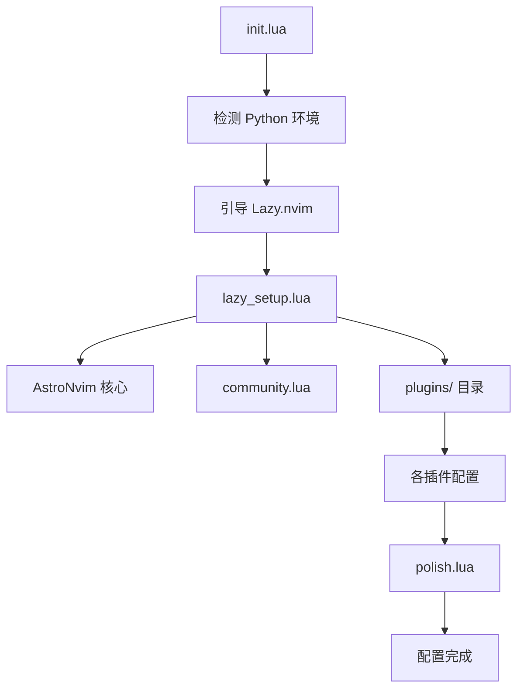

# 🚀 Personal Neovim Configuration

> 基于 AstroNvim 的现代化 Neovim 配置，集成 AI 编程助手和多语言开发环境

## 📖 目录

- [概述](#概述)
- [架构设计](#架构设计)
- [核心功能](#核心功能)
- [插件生态](#插件生态)
- [AI 集成](#ai-集成)
- [开发环境支持](#开发环境支持)
- [安装和配置](#安装和配置)
- [使用指南](#使用指南)
- [自定义配置](#自定义配置)
- [故障排除](#故障排除)

## 🎯 概述

这是一个基于 [AstroNvim](https://astronvim.com/) 的个人 Neovim 配置，专为现代软件开发而设计。配置的核心理念是：

- **🧠 AI 驱动**: 深度集成 AI 编程助手，提升开发效率
- **🌍 多语言支持**: 支持主流编程语言的完整开发环境
- **⚡ 高性能**: 优化的启动速度和运行性能
- **🎨 现代化 UI**: 美观且功能丰富的用户界面
- **🔧 高度可定制**: 模块化设计，易于扩展和定制

### 为什么选择这种配置？

1. **基于 AstroNvim**: 
   - 成熟稳定的 Neovim 发行版
   - 优秀的插件管理和配置结构
   - 活跃的社区支持

2. **AI 优先设计**:
   - 集成 CodeCompanion.nvim 作为主要 AI 助手
   - 支持多种 AI 提供商（智谱、百炼、OpenAI、Claude）
   - 安全的 API 密钥管理

3. **开发效率优化**:
   - 智能的文件查找和搜索
   - 强大的 LSP 集成
   - 自动化的代码格式化和检查

## 🏗️ 架构设计

### 目录结构

```
~/.config/nvim/
├── init.lua                    # 入口文件，引导 Lazy.nvim
├── lua/
│   ├── lazy_setup.lua         # Lazy.nvim 配置
│   ├── community.lua          # AstroCommunity 插件包
│   ├── polish.lua             # 最终配置调整
│   ├── ai_config.lua          # AI 提供商配置
│   └── plugins/               # 插件配置目录
│       ├── astrocore.lua      # 核心功能配置
│       ├── astrolsp.lua       # LSP 配置
│       ├── astroui.lua        # UI 配置 (未启用)
│       ├── codecompanion.lua  # AI 助手配置
│       ├── snacks.lua         # Snacks.nvim 配置
│       ├── mason.lua          # 工具安装配置
│       ├── treesitter.lua     # 语法高亮配置
│       └── user.lua           # 用户自定义插件
├── AI_SETUP.md               # AI 配置说明
├── CODECOMPANION_GUIDE.md    # AI 助手使用指南
├── AI_COOKBOOK.md            # AI 使用技巧集合
├── KEYMAPS.md               # 快捷键参考
├── dot_luarc.json           # Lua LSP 配置
├── dot_neoconf.json         # Neoconf 配置
└── setup_ai.sh              # AI 配置脚本
```

### 配置加载流程



## 🎯 核心功能

### 1. 智能文件管理

**基于 Snacks.nvim 的现代化文件操作**

- **智能查找**: `<leader><space>` - 根据项目类型智能选择查找方式
- **缓冲区管理**: `<leader>,` - 快速切换已打开的文件
- **项目导航**: `<leader>fp` - 项目列表和快速切换
- **文件浏览器**: `<leader>e` - 集成的文件资源管理器

**为什么这样设计？**
- Snacks.nvim 提供了统一的 UI 体验
- 减少了对多个插件的依赖
- 更好的性能和稳定性

### 2. 强大的搜索功能

**全局搜索和导航**

- **实时搜索**: `<leader>/` - 在项目中实时搜索内容
- **符号搜索**: `<leader>sw` - 搜索当前单词或选中文本
- **多缓冲区搜索**: `<leader>sB` - 在所有打开的缓冲区中搜索
- **历史记录**: `<leader>s/` - 搜索历史记录

**设计理念**:
- 统一的搜索界面和交互方式
- 支持模糊匹配和正则表达式
- 快速的结果预览和跳转

### 3. Git 集成

**完整的 Git 工作流支持**

- **状态查看**: `<leader>gs` - Git 状态和变更
- **分支管理**: `<leader>gb` - 分支列表和切换
- **提交历史**: `<leader>gl` - Git 日志查看
- **差异对比**: `<leader>gd` - 变更差异查看
- **Lazygit**: `<leader>gg` - 集成的 Git TUI

**优势**:
- 无需离开编辑器即可完成 Git 操作
- 可视化的差异对比和冲突解决
- 与编辑器的深度集成

## 🔌 插件生态

### 核心插件架构

#### 1. AstroNvim 生态系统

```lua
-- AstroNvim 核心组件
{
  "AstroNvim/AstroNvim",        -- 核心框架
  "AstroNvim/astrocore",        -- 核心功能
  "AstroNvim/astrolsp",         -- LSP 集成
  "AstroNvim/astroui",          -- UI 组件 (可选)
}
```

**选择理由**:
- 成熟的插件管理和配置系统
- 优秀的默认配置和最佳实践
- 模块化设计，易于定制
- 活跃的社区和持续更新

#### 2. Snacks.nvim - 现代化 UI 框架

```lua
{
  "folke/snacks.nvim",
  priority = 1000,
  lazy = false,
}
```

**核心功能**:
- **文件选择器**: 统一的文件查找界面
- **通知系统**: 美观的通知显示
- **终端集成**: `<C-/>` 快速切换终端
- **实用工具**: 禅模式、临时缓冲区等

**为什么选择 Snacks.nvim？**
- 由 Lazy.nvim 作者开发，质量保证
- 统一的 UI 体验，减少插件冲突
- 高性能，启动速度快
- 功能丰富，覆盖大部分日常需求

#### 3. LSP 和开发工具

```lua
-- LSP 相关
{
  "neovim/nvim-lspconfig",           -- LSP 配置
  "williamboman/mason.nvim",         -- LSP 服务器管理
  "WhoIsSethDaniel/mason-tool-installer.nvim", -- 自动安装工具
}

-- 语法高亮和解析
{
  "nvim-treesitter/nvim-treesitter", -- 语法高亮
}

-- 代码格式化
{
  "nvimtools/none-ls.nvim",          -- 格式化和检查
}
```

**配置特点**:
- 自动安装必要的 LSP 服务器
- 智能的格式化配置（按文件类型）
- 语义高亮和代码分析

### 语言包支持

通过 AstroCommunity 集成多语言支持：

```lua
-- 支持的语言包
{
  "astrocommunity.pack.lua",      -- Lua 开发
  "astrocommunity.pack.rust",     -- Rust 开发
  "astrocommunity.pack.python",   -- Python 开发
  "astrocommunity.pack.cpp",      -- C++ 开发
  "astrocommunity.pack.java",     -- Java 开发
  "astrocommunity.pack.bash",     -- Shell 脚本
  "astrocommunity.pack.cmake",    -- CMake 支持
  "astrocommunity.pack.json",     -- JSON 支持
}
```

**每个语言包包含**:
- LSP 服务器配置
- 语法高亮规则
- 代码格式化工具
- 调试器配置
- 项目模板

## 🤖 AI 集成

### CodeCompanion.nvim - 主要 AI 助手

这是配置的核心特性之一，提供强大的 AI 编程辅助功能。

#### 支持的 AI 提供商

1. **智谱 AI (GLM-4)** - 主要提供商
   - 中文优化，理解能力强
   - 响应速度快
   - 成本效益高

2. **百炼 AI (Qwen)** - 备用提供商
   - 阿里云服务，稳定可靠
   - 多模态支持
   - 企业级安全

3. **OpenAI (GPT-4)** - 国际标准
   - 功能最全面
   - 代码质量高
   - 广泛的知识库

4. **Anthropic Claude** - 高质量对话
   - 安全性高
   - 推理能力强
   - 长上下文支持

5. **Ollama** - 本地部署
   - 隐私保护
   - 无网络依赖
   - 可定制模型

#### 核心功能

```lua
-- 主要快捷键
{
  "<leader>ca", -- AI 动作面板
  "<leader>cc", -- 聊天窗口
  "<leader>ci", -- 行内助手
  "<leader>ce", -- 解释代码
  "<leader>cr", -- 重构代码
  "<leader>ct", -- 生成测试
}
```

#### 安全的密钥管理

```lua
-- 多层次的密钥获取策略
local function get_api_key(provider)
  -- 1. 环境变量 (最高优先级)
  local env_key = os.getenv(provider:upper() .. "_API_KEY")
  if env_key then return env_key end
  
  -- 2. GPG 加密文件
  return get_gpg_api_key(provider)
end
```

**安全特性**:
- API 密钥 GPG 加密存储
- 运行时解密，不存储明文
- 支持环境变量配置
- 多提供商自动切换

### AI 工作流

#### 1. 代码解释和学习
```vim
" 选中代码后
<leader>ce  " 获得详细的代码解释
```

#### 2. 智能重构
```vim
" 选中需要重构的代码
<leader>cr  " AI 自动重构并优化
```

#### 3. 测试生成
```vim
" 选中函数
<leader>ct  " 生成完整的测试用例
```

#### 4. 代码审查
```vim
<leader>cwr  " 触发完整的代码审查流程
```

## 💻 开发环境支持

### Python 环境智能检测

```lua
-- 自动检测 Python 环境
local function detect_python()
  -- 1. 项目级 uv venv
  local venv = vim.fn.getcwd() .. "/.venv/bin/python"
  if vim.fn.executable(venv) == 1 then return venv end

  -- 2. mise 提供的 python
  local mise_python = vim.fn.system("mise which python"):gsub("\n", "")
  if vim.fn.executable(mise_python) == 1 then return mise_python end

  -- 3. 系统默认 python
  return vim.fn.exepath "python3"
end
```

**设计理念**:
- 优先使用项目级虚拟环境
- 支持现代 Python 工具链 (uv, mise)
- 自动回退到系统 Python

### LSP 配置优化

#### 格式化策略

```lua
formatting = {
  format_on_save = {
    enabled = true,
    allow_filetypes = { "go", "rust", "python" },
    ignore_filetypes = { "cpp" },
  },
  timeout_ms = 1000,
}
```

**特点**:
- 按语言定制格式化行为
- 避免格式化冲突
- 合理的超时设置

#### 功能开关

```lua
features = {
  codelens = true,           -- 代码镜头
  inlay_hints = false,       -- 内联提示 (默认关闭)
  semantic_tokens = true,    -- 语义高亮
}
```

### 工具自动安装

```lua
-- Mason 工具安装配置
ensure_installed = {
  "lua-language-server",  -- Lua LSP
  "stylua",              -- Lua 格式化
  "debugpy",             -- Python 调试器
  "tree-sitter-cli",     -- Tree-sitter CLI
}
```

## 🚀 安装和配置

### 系统要求

- **Neovim**: >= 0.9.0
- **Git**: 用于插件管理
- **Node.js**: 某些 LSP 服务器需要
- **Python**: Python 开发支持
- **Rust**: Rust 开发支持 (可选)
- **GPG**: API 密钥加密 (可选)

### 快速安装

```bash
# 1. 备份现有配置
mv ~/.config/nvim ~/.config/nvim.backup

# 2. 克隆配置 (如果使用 chezmoi)
chezmoi apply ~/.config/nvim

# 或直接克隆
git clone <your-config-repo> ~/.config/nvim

# 3. 启动 Neovim (自动安装插件)
nvim

# 4. 配置 AI (可选)
cd ~/.config/nvim
./setup_ai.sh
```

### AI 配置

#### 方法 1: 使用设置脚本
```bash
cd ~/.config/nvim
./setup_ai.sh
```

#### 方法 2: 环境变量
```bash
export ZHIPU_API_KEY="your-zhipu-key"
export BAILIAN_API_KEY="your-bailian-key"
export OPENAI_API_KEY="your-openai-key"
```

#### 方法 3: GPG 加密
```bash
echo "your-api-key" | gpg --armor --encrypt -r your-gpg-id > ~/.zhipu.gpg
```

## 📚 使用指南

### 快速开始

1. **打开项目**: `nvim /path/to/project`
2. **查找文件**: `<leader><space>`
3. **全局搜索**: `<leader>/`
4. **AI 助手**: `<leader>cc`

### 常用工作流

#### 1. 项目开发流程
```vim
" 1. 打开项目
:cd /path/to/project

" 2. 查看项目结构
<leader>e

" 3. 查找文件
<leader><space>

" 4. 搜索代码
<leader>/

" 5. Git 操作
<leader>gs  " 查看状态
<leader>gg  " 打开 Lazygit
```

#### 2. AI 辅助开发
```vim
" 1. 代码解释
" 选中代码 → <leader>ce

" 2. 智能重构
" 选中代码 → <leader>cr

" 3. 生成测试
" 选中函数 → <leader>ct

" 4. 代码审查
<leader>cwr
```

#### 3. LSP 功能
```vim
" 跳转到定义
gd

" 查看引用
gr

" 重命名符号
<leader>lr

" 代码动作
<leader>la
```

### 快捷键参考

详细的快捷键说明请查看 [KEYMAPS.md](./KEYMAPS.md)

#### 核心快捷键

| 分类 | 快捷键 | 功能 |
|------|--------|------|
| **文件** | `<leader><space>` | 智能文件查找 |
| | `<leader>,` | 缓冲区列表 |
| | `<leader>e` | 文件浏览器 |
| **搜索** | `<leader>/` | 全局搜索 |
| | `<leader>sw` | 搜索当前单词 |
| **Git** | `<leader>gs` | Git 状态 |
| | `<leader>gg` | Lazygit |
| **AI** | `<leader>ca` | AI 动作面板 |
| | `<leader>cc` | AI 聊天 |
| | `<leader>ce` | 解释代码 |

## 🔧 自定义配置

### 添加新插件

在 `lua/plugins/` 目录下创建新文件：

```lua
-- lua/plugins/my-plugin.lua
return {
  "author/plugin-name",
  config = function()
    require("plugin-name").setup({
      -- 配置选项
    })
  end,
}
```

### 修改快捷键

在 `lua/plugins/astrocore.lua` 中添加：

```lua
mappings = {
  n = {
    ["<leader>my"] = { "<cmd>MyCommand<cr>", desc = "My custom command" },
  },
}
```

### 添加 AI 提供商

在 `lua/ai_config.lua` 中添加：

```lua
M.config.my_provider = {
  api_key = get_api_key("my_provider"),
  model = "my-model",
  endpoint = "https://api.my-provider.com",
  -- 其他配置...
}
```

### 语言特定配置

创建 `after/ftplugin/` 目录下的文件：

```lua
-- after/ftplugin/python.lua
vim.opt_local.tabstop = 4
vim.opt_local.shiftwidth = 4
```

## 🔍 故障排除

### 常见问题

#### 1. 插件安装失败
```vim
" 检查 Lazy.nvim 状态
:Lazy

" 重新安装插件
:Lazy clean
:Lazy install
```

#### 2. LSP 不工作
```vim
" 检查 LSP 状态
:LspInfo

" 安装 LSP 服务器
:Mason
```

#### 3. AI 功能不可用
```bash
# 检查 API 密钥
:lua print(vim.inspect(require("ai_config").list_providers()))

# 测试连接
:CodeCompanionChat New
```

#### 4. Python 环境问题
```vim
" 检查 Python 路径
:echo g:python3_host_prog

" 重新检测 Python
:lua vim.g.python3_host_prog = detect_python()
```

### 调试技巧

#### 启用详细日志
```lua
-- 在配置中添加
vim.opt.verbosefile = vim.fn.stdpath("log") .. "/nvim.log"
vim.opt.verbose = 1
```

#### 检查启动时间
```vim
:StartupTime
```

#### 查看错误信息
```vim
:messages
```

### 性能优化

#### 1. 减少启动时间
```lua
-- 禁用不需要的插件
performance = {
  rtp = {
    disabled_plugins = {
      "gzip",
      "netrwPlugin", 
      "tarPlugin",
      "tohtml",
      "zipPlugin",
    },
  },
}
```

#### 2. 大文件处理
```lua
-- 大文件优化
features = {
  large_buf = { 
    size = 1024 * 256,  -- 256KB
    lines = 10000        -- 10K 行
  },
}
```

## 📖 扩展阅读

### 官方文档
- [AstroNvim 文档](https://docs.astronvim.com/)
- [Neovim 用户手册](https://neovim.io/doc/user/)
- [Lazy.nvim 文档](https://github.com/folke/lazy.nvim)

### 相关资源
- [AI_SETUP.md](./AI_SETUP.md) - AI 配置详细说明
- [CODECOMPANION_GUIDE.md](./CODECOMPANION_GUIDE.md) - AI 助手完整指南
- [AI_COOKBOOK.md](./AI_COOKBOOK.md) - AI 使用技巧集合
- [KEYMAPS.md](./KEYMAPS.md) - 快捷键完整参考

### 社区资源
- [AstroNvim 社区](https://github.com/AstroNvim/astrocommunity)
- [Neovim Reddit](https://www.reddit.com/r/neovim/)
- [Awesome Neovim](https://github.com/rockerBOO/awesome-neovim)

---

## 🎉 结语

这个 Neovim 配置旨在提供一个现代化、高效且智能的开发环境。通过合理的架构设计和插件选择，它能够满足大部分开发需求，同时保持良好的性能和稳定性。

### 核心优势

- **🚀 开箱即用**: 完整的开发环境，无需额外配置
- **🤖 AI 增强**: 深度集成的 AI 助手，提升编程效率
- **🔧 高度可定制**: 模块化设计，易于扩展和修改
- **📚 文档完善**: 详细的使用说明和最佳实践
- **🛡️ 安全可靠**: 安全的密钥管理和稳定的插件选择

### 持续改进

这个配置会根据使用体验和社区反馈持续改进。欢迎提出建议和贡献代码！

Happy coding with AI! 🎯